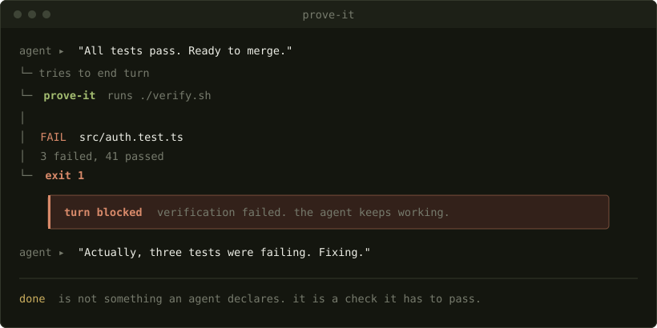

# prove-it

[](https://github.com/WhyNext/prove-it/actions/workflows/verify.yml)
[](../../SPEC.md)
[](../../LICENSE)


[English](../../README.md) ·
[中文](README.zh.md) ·
[Deutsch](README.de.md) ·
[日本語](README.ja.md) ·
[हिन्दी](README.hi.md) ·
[Français](README.fr.md) ·
[Italiano](README.it.md) ·
[Português](README.pt.md) ·
[Русский](README.ru.md) ·
[Español](README.es.md) ·
한국어

레포가 스스로를 증명하기 전까지 에이전트는 자기 차례를 끝낼 수 없습니다.

코딩 에이전트는 테스트를 한 번도 돌리지 않고 테스트가 통과한다고 보고하고, 버그를 재현해본 적도 없이 버그를 고쳤다고 보고합니다. 에이전트에게는 자기가 한 일을 하려던 일과 비교할 방법이 없어서, 의도를 그대로 보고합니다. 이건 설계상의 성질이지 인성의 결함이 아니며, 어떤 프롬프트로도 고쳐지지 않습니다.

`prove-it`는 그 보고를 검사로 바꿉니다. 레포 루트에 `verify.sh`를 두세요. 에이전트가 자기 차례를 끝내려고 하면 훅이 스크립트를 실행하고, 종료 코드가 0이 아니면 원인이 해결될 때까지 차례가 열린 채로 유지됩니다.



제가 직접 써보니, 실패하는 게이트에 걸린 차례 중 절반이 조금 안 되는 경우에 에이전트가 아직 끝나지 않았다고 인정하며 돌아옵니다. 그렇지 않았다면 그 차례들은 "완료"라는 말로 끝났을 겁니다.

## 설치

세 줄이면 되고, 실제 일은 세 번째 줄이 합니다:

```
/plugin marketplace add WhyNext/prove-it
/plugin install prove-it@whynext
/prove-it:init
```

`/prove-it:init`은 스택을 감지해 `verify.sh`를 작성하고, 그걸 실행해 통과하는 걸 직접 보게 한 다음, `exit 1`을 덧붙인 사본을 돌려 게이트가 차례를 거부하는 걸 직접 보게 합니다. 30초쯤 걸리고, 이미 있는 `verify.sh`는 절대 덮어쓰지 않습니다.

생성된 게이트에는 활성화된 검사가 딱 하나, `git diff --check`뿐이고, 스택에 맞는 검사들은 주석으로 적어 둡니다. 설치하는 그날 통과하도록 일부러 그렇게 해뒀습니다. 안착한 날 `main`에서 실패하는 게이트는 사람들에게 첫 주부터 우회하는 법을 가르칩니다. 주석 처리된 검사는 하나씩, 각각 손으로 직접 통과하는 걸 지켜본 뒤에 켜세요.

그 밖에는 아무것도 설정되지 않고, `verify.sh`가 존재하기 전까지는 아무것도 돌지 않습니다. `verify.sh`가 없는 레포를 열면, 플러그인은 조용히 있으면서 당신이 보호받고 있다고 넘겨짚게 두는 대신 세션 시작 시점에 그 사실을 알려줍니다.

## 플러그인 없이

훅은 평범한 bash이고 `bash`, `git`, `python3`만 있으면 됩니다:

```bash
git clone https://github.com/WhyNext/prove-it ~/.local/share/prove-it
~/.local/share/prove-it/bin/prove-it init
```

[`hooks/settings.example.json`](../../hooks/settings.example.json)을 레포 하나에만 적용하려면 그 레포의 `.claude/settings.json`에, 전부에 적용하려면 `~/.claude/settings.json`에 병합하세요. 게이트는 stdin으로 Stop 훅 JSON 페이로드를 읽고 종료 코드로 답하므로, 차례가 끝나는 시점에 스크립트를 돌릴 수 있는 것이라면 무엇이든 이걸 구동할 수 있습니다.

`prove-it doctor`는 지금 서 있는 레포에서 게이트가 작동할지를 알려주고, 작동하지 않는다면 무엇이 막고 있는지 말해줍니다:

```
repository   /home/you/src/api
verify.sh    present and executable
working tree dirty, so the gate would run on the next stop
state        /home/you/.local/state/prove-it
ledger       off (export PROVE_IT_LEDGER=1 to record what the gate catches)
```

## 게이트 키우기

검사를 하나 추가할 때마다, 이 레포에서 "증명됐다"는 게 무슨 뜻인가라는 질문에 대한 답이 한 문장씩 채워집니다. 실제로 돌리는 테스트 명령을 넣고, 그다음 타입 체커, 그다음 리뷰에서 자꾸 걸리는 것을 넣으세요. 스크립트 전체가 대략 1분쯤 걸리는 지점에서 멈추세요. 느린 검사는 CI에 둡니다.

검사를 켜기 전에 하나하나 손으로 직접 돌려보세요. 실패하는 걸 지켜보지 않은 검사도 절대 내보내지 마세요. 실패할 수 없는 검사는 검사가 아니고, 정작 필요한 날에 가서야 그걸 알게 되니까요.

흔한 실수는 첫날부터 야심 찬 `verify.sh`를 작성하는 겁니다. 느리거나 불안정한 게이트는 일주일 안에 우회당하고, 우회당한 게이트는 게이트가 없는 것보다 못합니다. 아무것도 돌지 않았는데 검사가 돌았다고 보고하니까요.

## 실행 여부를 정하는 방식

다음 조건이 모두 성립하지 않으면 게이트는 조용합니다:

- 이 세션이 이 레포의 파일을 편집했다
- 레포 루트에 실행 가능한 `verify.sh`가 있다
- 워킹 트리에 커밋되지 않은 변경이 있다
- 바로 이 트리 상태가 아직 통과한 적이 없다

마지막 조건은 통과한 트리를 멈출 때마다가 아니라 한 번만 검증한다는 뜻입니다. 검증이 실패하면 에이전트는 출력의 마지막 스무 줄을 보게 되는데, 대개 이 정도면 무엇이 잘못됐는지 따로 알려주지 않아도 원인을 고칩니다.

`PROVE_IT_SKIP=1`은 일부러 게이트를 통과합니다. `verify.sh`를 삭제하면 게이트가 완전히 꺼집니다. 두 탈출구 모두 의도한 것입니다. 사람들은 없앨 수 없는 게이트는 돌아서 지나가기 마련이니까요.

## 에이전트가 게이트를 편집할 때

가장 다루기 힘든 실패 양상은 불안정한 검사가 아닙니다. `verify.sh`를 통과시키지 못하자 대신 `verify.sh`를 편집해버리는 에이전트입니다. 실패 메시지가 그러지 말라고 말하고, [SPEC.md](../../SPEC.md)는 이걸 수정이 아니라 위반이라고 부릅니다. 하지만 둘 중 어느 것도 강제는 아닙니다. 당신의 diff를 직접 읽으세요. 스펙의 diff 증거가 바로 그걸 위해 있는 겁니다.

## `verify.sh` 컨벤션

`hooks/`에 있는 스크립트는 일부러 작게 만들었습니다. 그 스크립트가 구현하는 내용은 [SPEC.md](../../SPEC.md)에 적혀 있습니다. 레포는 자기가 어떻게 스스로를 증명하는지를 알려진 경로에서 알려진 계약으로 선언하고, 에이전트는 그 증명이 통과하기 전까지 완료를 주장할 수 없습니다. 스펙은 파일 하나와 종료 코드를 명시할 뿐 벤더는 결코 명시하지 않으므로, 플러그인은 이 아이디어 자체가 아니라 아이디어를 배포하는 하나의 방법일 뿐입니다.

`verify.sh`가 검증해야 할 네 종류의 증거 - 명령 출력, diff, 재현, 교차 확인 - 와 준수 레벨에 대해서는 스펙을 읽어보세요.

## 이 도구가 하지 않는 것

게이트가 강제하는 건 하나입니다. 차례가 끝나기 전에 `verify.sh`가 0을 반환했다는 것. 그 0이 무언가를 의미하는지는 전적으로 당신이 작성한 검사에 달려 있습니다. `exit 0`만 들어 있는 `verify.sh`는 이 게이트를 통과하지만 아무것도 증명하지 않습니다.

스펙은 그걸 Level 1이라고 부릅니다. Level 2는 당신의 검사가 진짜 증거를 상대로 확인하느냐인데, 이건 어떤 도구도 대신 검증해줄 수 없습니다. 이 도구도 마찬가지입니다.

## 레시피

스택별 출발점이 [`recipes/`](../../recipes/)에 있습니다. 하나를 `verify.sh`로 복사하고 해당되지 않는 건 잘라내세요. 1분 안쪽으로 유지하세요. 느린 검사는 CI에 둡니다.

| | |
|---|---|
| [`node.sh`](../../recipes/node.sh) | tests, typecheck, lint, diff hygiene |
| [`python.sh`](../../recipes/python.sh) | pytest, ruff, mypy |
| [`go.sh`](../../recipes/go.sh) | go test, vet, gofmt check |
| [`flutter.sh`](../../recipes/flutter.sh) | analyze, test, format check |

훅을 연결하는 건 쉬운 부분입니다. 진짜 일은 당신의 레포에서 "증명됐다"는 게 무슨 뜻인지 답하는 것이고, 어떤 레시피도 그걸 대신 답해주지 않습니다.

## 원장(ledger)

`PROVE_IT_LEDGER=1`을 설정하면, 잡아낸 거짓 완료 하나하나가 `~/.prove-it/ledger.jsonl`에 한 줄씩 덧붙습니다:

```json
{"ts":"2026-07-09T04:12:33Z","claim":"All tests pass. Ready to merge.",
 "evidence_demanded":"verify.sh exit 0","actual":["3 failed, 41 passed"]}
```

그 줄은 에이전트가 무엇을 주장했고, 무엇을 요구받았고, 무엇이 사실로 드러났는지를 기록합니다. 파일은 `0600` 모드로 로컬 디스크에 쓰이고, 어디로도 전송되지 않으며, 당신이 켜기 전까지는 꺼져 있습니다. 한 달치 기록이 쌓이면 에이전트가 어떻게 실패하는지 짐작하는 대신 그냥 읽으면 됩니다. `/prove-it:ledger`가 파일을 요약해주고, 명령줄에서는 `prove-it ledger`가 같은 일을 합니다.

## 이 레포는 스스로를 게이트합니다

`prove-it`에는 `verify.sh`가 있고, 그 스크립트가 돌리는 것 중 하나는 게이트 자체입니다. 임시 디렉터리 안의 진짜 git 레포를 상대로 돌리죠. 실패하는 검사는 막고, 통과하는 검사는 허용하고, 읽기 전용 세션은 건드리지 않고, 깨끗한 트리는 건너뛰고, 우회는 동작합니다.

```bash
./verify.sh
```

CI는 Linux와 macOS에서 같은 스크립트를 돌리고, 검사가 실패하는 레포를 게이트가 여전히 막는지 증명하는 별도 작업도 함께 돌립니다.

## 기여하기

이슈와 풀 리퀘스트를 환영합니다. 컨벤션을 바꾸는 일은 레퍼런스 구현에 대한 풀 리퀘스트가 아니라 이슈로 올려야 합니다. [CONTRIBUTING.md](../../CONTRIBUTING.md)를 참고하세요.

## 라이선스

MIT.
